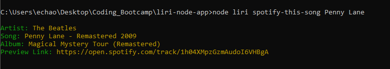

# LIRI Bot
LIRI is a _Language Interpretation and Recognition Interface_. This is a command line node app that can give you a list of concerts based on an artist name, details on a song, or details about a movie.

## Installation
After cloning this repo, run:
```console
npm install
```

## Usage


### concert-this
Get a list of concerts for the artist "Slayer":  


### spotify-this-song
Get details for the song "Penny Lane":  



### movie-this
Get details for the movie "The Matrix":  

